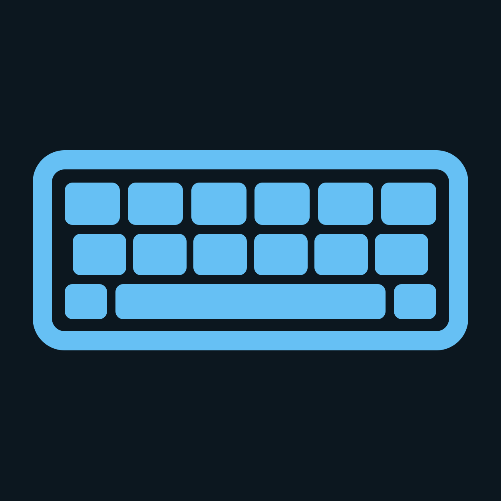
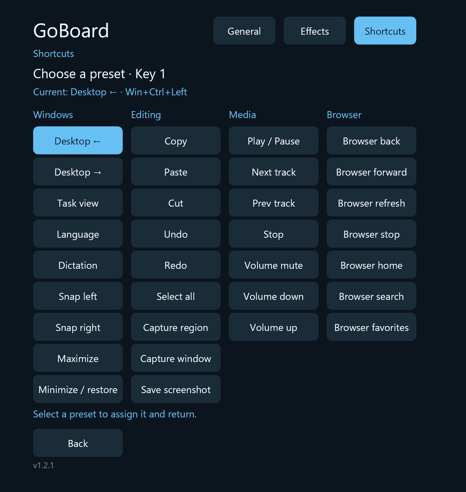

  

# GoBoard

A VR keyboard for SteamVR, inspired by [YuuBoard](https://yuuzami.itch.io/yuuboard). Labels follow your active Windows keyboard layout.

## Install

[Download the latest release](https://github.com/Gosha/GoBoard/releases/latest). Requires Windows x64, SteamVR, and a connected headset. Choose:

- **Standard setup (.exe):** Small download. Uses Microsoft .NET 10 Desktop Runtime if installed, or offers to download it. Installing the runtime may require administrator approval.
- **Offline setup (.msi):** Includes .NET; needs no internet or administrator access.

The installer is unsigned, so you may need to accept a Windows security warning to continue.

## Use

Launch **GoBoard VR** or **GoBoard Settings** from the Start menu.

- **Settings:** Adjust size, themes, sounds, effects, and shortcuts.
- **Shortcuts:** Set **Settings → Shortcuts → Floating button → Shown**, then click the floating button to open the shortcut panel. Select a key in Settings to change its assignment.

### Settings

More settings screenshots

## Run from source

Install the [.NET 10 SDK](global.json), then run from the repository root in PowerShell:

| Mode          | Command                        |
| ------------- | ------------------------------ |
| SteamVR       | `.\start-goboard.ps1`          |
| Debug desktop | `.\start-goboard.ps1 -Desktop` |
| Settings      | `.\settings-goboard.ps1`       |
| Stop          | `.\stop-goboard.ps1`           |

The desktop keyboard is a source-only debugging tool. See [development](docs/development.md#desktop-debugging-host).

## More

- [SteamVR autostart: enable, disable, and unregister](docs/steamvr-autostart.md)
- [Keyboard layouts and limitations](docs/automatic-keyboard-layouts.md)
- [Installation and release details](docs/packaging.md)
- [Development and feature details](docs/development.md)
- [Contributing](AGENTS.md)
- [Sound credits](assets/audio/mechanical/CREDITS.md)
