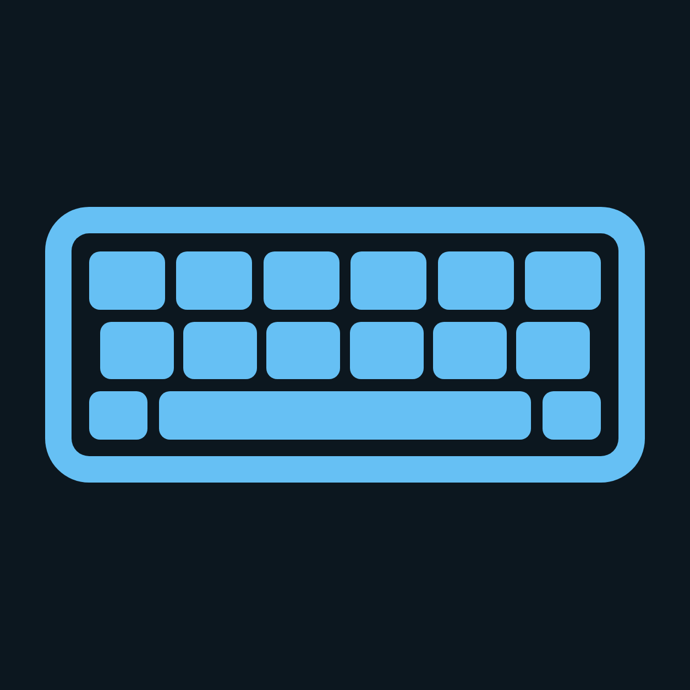
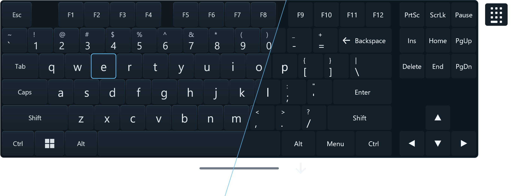
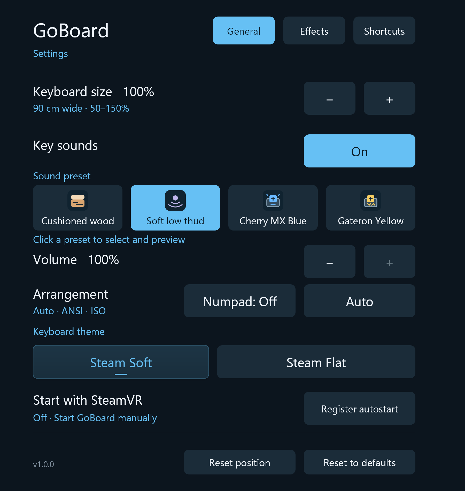
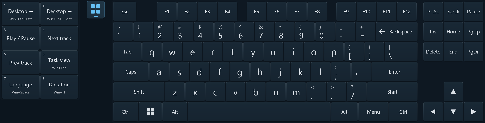
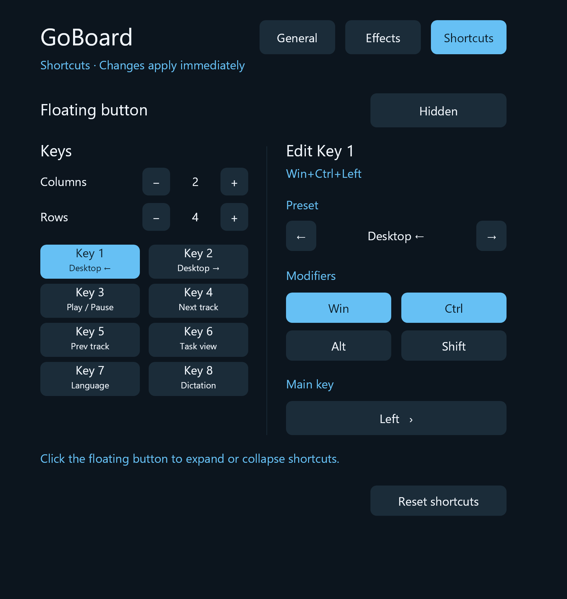
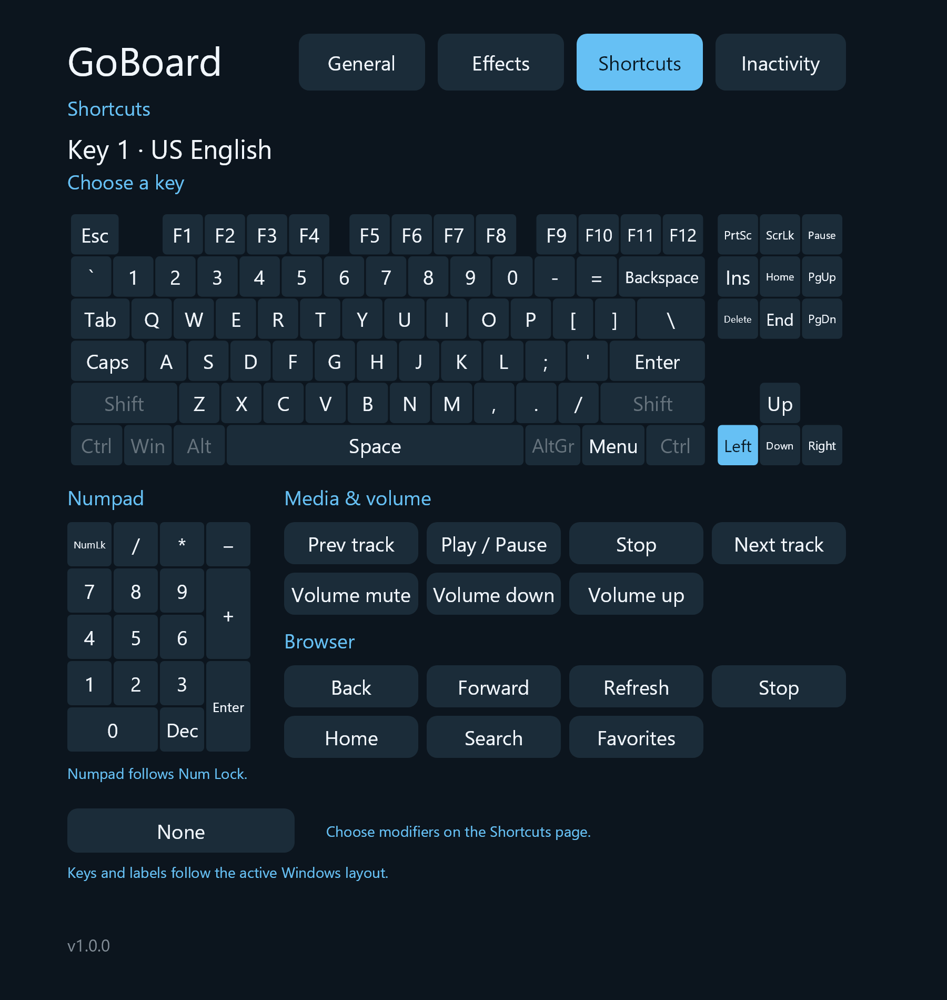

  

# GoBoard

A keyboard for SteamVR and Windows desktop, inspired by [YuuBoard](https://yuuzami.itch.io/yuuboard). Labels follow your active Windows keyboard layout.

## Install

[Download the latest release](https://github.com/Gosha/GoBoard/releases/latest).

Choose a tagged **Stable** release (such as v1.0.0) or **Beta** prerelease (such as v1.0.1-beta.1). Both use one Windows x64 installation: installing either channel replaces the other and keeps your settings. The MSI includes .NET and adds VR, Desktop, and Settings shortcuts. See [MSI packaging and tagged releases](docs/packaging.md) for downloads, local builds, and version rules.

## Run from source

Requires Windows x64 and the [.NET 10 SDK](global.json). VR mode needs SteamVR and a connected headset.

From the repository root in PowerShell:

| Mode     | Command                        |
| -------- | ------------------------------ |
| SteamVR  | `.\start-goboard.ps1`          |
| Desktop  | `.\start-goboard.ps1 -Desktop` |
| Settings | `.\settings-goboard.ps1`       |
| Stop     | `.\stop-goboard.ps1`           |

In VR, open the dashboard, focus a text field in Desktop, then point and pull the trigger to type. Drag the line below the keyboard to move it or the corner grip to resize it.

On desktop, select a window and click the keys. Open **Settings** for size, themes, sounds, effects, and programmable shortcuts.

In **Settings → Shortcuts**, set **Floating button** to **Shown**. Click the little button to expand or collapse a separate shortcut window on the left. Drag its line to move it. Choose **1–4 columns** and **1–5 rows**; the default is the original eight shortcuts in a 2×4 grid. Removed rows and columns retain their assignments.

The Shortcuts page shows the key grid and row/column controls on the left. Select a numbered key to edit its preset, modifiers, and main key on the right. The picker uses a compact keyboard layout with familiar key positions, including Swedish Å/Ä/Ö, and updates shifted labels when Shift is selected. A numpad and grouped media, volume, and browser keys appear below it. Numpad keys follow Windows Num Lock. Changes are saved and apply to both desktop and VR.

Presets include virtual desktop left/right, media playback, volume up/down/mute, browser controls, Task view, language switching, and dictation. Editing presets cover Copy, Paste, Cut, Undo, Redo, and Select All. Screen controls include region/window screenshots, saving a screenshot, snapping left/right, maximizing, and minimizing/restoring. The original eight assignments remain the default.

On desktop, the floating panel fits closely around its keys. Input errors and layout warnings appear in the top drag strip; hover there for details.

## More

- [Keyboard layouts and limitations](docs/automatic-keyboard-layouts.md)
- [Development and feature details](docs/development.md)
- [Contributing](AGENTS.md)
- [Sound credits](assets/audio/mechanical/CREDITS.md)

## Disclaimer

Essentially 100% vibe-coded.
