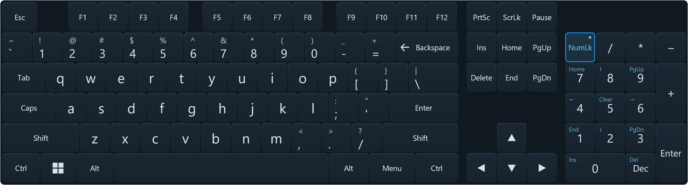

# Development

See [AGENTS.md](../AGENTS.md) for project boundaries, contributor workflows, and engineering constraints. This document covers implementation details, troubleshooting, and validation evidence.

GoBoard uses the Windows GUI subsystem so direct and installed launches do not create console windows. Existing terminal output and redirected stdout/stderr remain available; the source launcher still captures `.runtime/app/goboard.log` and `goboard.error.log`. With no terminal or redirection, diagnostics go to a separate file per launch under `%LOCALAPPDATA%\GoBoard\logs`. These logs contain operational diagnostics, never typed text, and may be deleted when the app is closed. When scripting the GUI executable directly, use `Start-Process -Wait -PassThru` to wait for completion and inspect its exit code. MSI validation checks the subsystem of the extracted executable.

On every launch, startup-log cleanup keeps the newest 20 timestamped files in `%LOCALAPPDATA%\GoBoard\logs` and removes files last written more than 30 days ago. The current log counts toward the limit. Active or inaccessible logs are skipped and retried on later launches, so the limit may temporarily be exceeded; cleanup failures do not prevent startup. Cleanup also runs for console/redirected launches, does not recurse into subfolders, and leaves unrelated files alone. The fixed `runtime\goboard.log` and `runtime\goboard.error.log` files are still overwritten when runtime logging starts. There is no size-based rotation during a running session.

## Prerequisites and commands

The keyboard has a keypad-icon toggle directly above Num Lock when the numpad is open; it stays in the same position, floating beside the main keys, when closed. A transparent down-arrow reset control sits beside the VR grab handle (beside the draggable title bar on desktop). The toggle and reset arrow follow the main keys without shifting when the numpad opens or closes. The floating numpad button opens or closes the integrated keypad; Settings controls whether that floating button is shown. Button visibility and keypad visibility are saved separately, and hiding the button preserves an already-open keypad. Reset uses the shared position-reset request. Both controls activate on release, cancel on pointer loss, movement away, geometry or target changes, and send no keyboard input. VR also cancels their captures while grabbing or resizing. Reset draws only the arrow in idle, hover and pressed states; desktop uses per-pixel-alpha, non-activating windows. Add `--controls` to a main keyboard `--render` command to include the floating controls and VR grab handle in PNG previews.

The canonical [build, test, preview, and launch commands](../AGENTS.md#build-and-validation) are in AGENTS.md. Feature-specific previews and native integration commands are documented below alongside their coverage and limitations.

If another GoBoard process still has the selected launcher build loaded, the launcher uses a fresh suffixed build directory instead of overwriting locked DLLs.

Production logs live under `%LOCALAPPDATA%\GoBoard\runtime`; a session-local named event provides graceful shutdown through `stop-goboard.ps1` even when SteamVR starts GoBoard directly. See [SteamVR autostart](steamvr-autostart.md) for registration commands and acceptance checks.

## Native SteamVR keyboard visibility

In VR, GoBoard hides its keyboard, move/resize handles, shortcut launcher, and expanded shortcut palette while SteamVR's native keyboard is visible. It returns when the native keyboard closes, provided the dashboard and its anchor are available. Dashboard-relative placement and the palette's expanded/collapsed state are retained. Hiding cancels typing, repeat, modifiers, grabs, and pending resize changes through the existing hidden-state path; queued input is discarded before interaction resumes. The GoBoard Settings dashboard tab remains independent. Desktop mode is unchanged.

`NativeKeyboardVisibility` polls `system.keyboard` and `valve.steam.gamepadui.keyboard` through OpenVR before each visibility update. These keys were verified in the installed SteamVR dashboard resources and live runtime; they are compatibility details rather than public SDK constants, just like the dashboard bar anchor. Both keyboards are checked, and either can suppress GoBoard. Current visibility handles startup with an already-open keyboard without depending on earlier open events. Handles are resolved again on each poll so keyboard creation/destruction does not leave a stale cached handle. Missing overlays are treated as hidden. If SteamVR changes these keys, update this compatibility adapter; the application does not hide or modify SteamVR's keyboard itself.

Validation: locked restore and Release build passed with zero warnings/errors; all 301 regression tests passed. New tests cover already-open startup, repeated toggles, overlapping native keyboards, missing/recreated overlays, failed lookups, and invalid handles. A disposable live OpenVR probe using the production detector successfully observed `ShowKeyboard`, detection by a fresh instance while already open, and `HideKeyboard`. It did not read or inject text, change settings, or restart the running GoBoard instance. There are no visual design changes requiring new screenshots.

Remaining headset acceptance: open/close the native keyboard from the SteamVR desktop and Steam UI, including with GoBoard's palette expanded; verify all GoBoard input surfaces hide and return in place. Repeat while holding a key/modifier, moving either panel, and resizing; verify cancellation without stuck keys, stale clicks, or a saved partial resize. Close the dashboard while the native keyboard is open and confirm GoBoard stays hidden until the native keyboard is closed and the dashboard is visible again. The automated checks do not establish controller feel or headset presentation timing.

## Desktop debugging host

The **Gateron Yellow** audio preset rotates the user's four saved Gateron pairs (G02, GO1, GO3, GO4). It plays the matching release on controller/mouse up, tracks each pointer independently and allows up to eight simultaneous tails. Its saved 65% audition level is included in the assets; the shared volume remains an additional trim. Settings previews play press then release after 200 ms. Provenance and regeneration: `experiments/GoBoard.SoundSamples/paired-manifest.json` and `export-pairs.mjs`.

GoBoard is a VR app. The desktop keyboard exists only for source-build debugging and native integration checks; it is excluded from installed builds. The standalone Windows Settings window remains part of the VR app. Source builds (including Release) enable `EnableDesktopDebug` by default; `build-msi.ps1` publishes with `-p:EnableDesktopDebug=false`, excluding the desktop host and checks that depend on it. Run `./start-goboard.ps1 -Desktop`, or a source-built `GoBoard.exe --desktop [--stop-file PATH] [--seconds N]`. Desktop mode starts the keyboard and provides Settings/Close controls without initializing SteamVR or loading its native DLL. The launch script builds this mode under `artifacts/desktop-build` so existing settings windows from the standard build do not lock its output. Both live modes share a session-local instance guard, stop signal, and logs; only one keyboard can run per Windows session. Settings and diagnostic commands remain independent.

The keyboard is a topmost, non-activating Windows Forms surface displaying the real Skia keyboard. Select a text field in another app, then click the keys; dragging the header moves the window. Settings opens an ordinary focused window, so select your text target again afterward. Closing the keyboard also closes its settings window. Foreground HWND/HKL detection, layout legends, balanced scan-code input, logical modifiers, and repeat reuse the production model/backend. Readable Windows layouts use generated labels and Auto/ANSI/ISO geometry. Unsupported layouts remain usable with US English geometry and labels, regardless of the previously recognized layout. Windows still interprets scan codes using its active layout, so the panel warns that output may differ from the labels. Lost mouse capture, hiding, target/layout changes, resizing, and closing cancel pending input. This mode uses one mouse pointer; two-controller behavior remains specific to VR.

Size uses the shared 50–150% setting, with 100% corresponding to 850 logical desktop pixels plus a 42-pixel header before display scaling. It scales with monitor DPI and fits the monitor's work area. The VR physical width and desktop pixel width share a percentage, not a physical measurement. Sound settings are identical in both modes. Desktop placement is session-only.

Desktop preview and a guarded native integration check (the latter temporarily focuses a disposable text window):

```powershell
dotnet run --project src/GoBoard.App -c Release -- --render-desktop .runtime\desktop-keyboard.png
dotnet run --project src/GoBoard.App -c Release -- --desktop-input-check
```

`GoBoard.exe --desktop-launch-check` starts the keyboard first and clicks its Settings button without injecting keys. Run it through `Start-Process -WindowStyle Hidden -Wait` to reproduce the PowerShell launcher's startup flags. It verifies that Settings is natively visible, has the normal taskbar window style, and is not topmost. This catches Windows applying the hidden-console startup hint to the first activating window even while WinForms reports `Visible=true`; the settings host explicitly shows that window after the hint is consumed.

The native check sends mouse messages to the real keyboard window, verifies its non-activation style and behavior, types only into its disposable text field, and restores the previous foreground window. It covers text, one-shot/locked Shift, Ctrl+A, repeat release, capture-loss cancellation, cleanup, and absence of the OpenVR native module. It also opens Settings using the keyboard button, verifies a balanced F8 stroke without a text box, and checks Windows-key arming. These checks use the production input path with no exemption for test windows in the same process. Unit tests cover pixel-to-key mapping at multiple sizes/DPIs and monitor constraints. The desktop preview has been visually inspected. Physical pointer dragging, mixed-DPI monitor transitions, and application-specific shortcuts remain manual acceptance checks.

Input is sent to any current foreground window, including GoBoard Settings; a focused text box is not required. Missing foreground windows, focus/layout changes, and pending input cleanup still prevent stale input. The header identifies the receiving process without implying that a text field must be selected.

`--desktop-shell-check` extends the desktop input check by clicking Win a second time from Settings and requiring Start to take focus. It sends Escape only after identifying `StartMenuExperienceHost`. On this machine the standalone shell check instead observed `SearchHost`, so automated Start-menu acceptance remains inconclusive; this check deliberately does not treat another shell process as proof that Start opened. The user subsequently confirmed that the fix works in normal use.

The Windows integration commands remain explicit because they activate a disposable native test window or Windows shell UI:

```powershell
dotnet run --project src/GoBoard.App -c Release -- --input-check
dotnet run --project src/GoBoard.App -c Release -- --layout-check
dotnet run --project src/GoBoard.App -c Release -- --ime-check
dotnet run --project src/GoBoard.App -c Release -- --shell-check
```

Do not use them while working in a user document. `--input-check`, `--layout-check`, and `--ime-check` guard their disposable test target and abort when focus changes. The IME check uses an already-loaded Japanese layout and verifies the あ/A button with actual Latin/Hiragana typing. The recent broad shortcut check stopped safely when F10 transferred focus, so application-level shortcut behavior remains a manual acceptance check.

## Settings and keyboard sound

### Programmable keys

**Settings → Shortcuts → Floating button → Shown** makes a small launcher available to the left of the keyboard. Click it to expand/collapse a separate shortcut palette. The floating button is hidden by default. The launcher starts collapsed; hiding it in Settings also closes the palette. On desktop, drag the line under the launcher or above the palette to move them. In VR, drag the palette's separate grab line; its placement follows the main keyboard with its own offset. Reset position restores the initial placement. Expansion and placement are session-only.

The grid supports 1–4 columns and 1–5 rows, defaulting to the original eight presets in 2×4. Stable row/column slots preserve hidden assignments when removing and restoring rows/columns. Additional slots start unassigned. Visible key numbers follow the grid; saved assignments retain their row/column positions, including files from the original two-column version. Select a slot and click its preset field to open a chooser with Windows, Editing, Media, and Browser groups. All presets are visible at once; selecting one assigns it and returns to the editor. The current preset is highlighted, and Back leaves the assignment unchanged. For a custom shortcut, toggle Win/Ctrl/Alt/Shift and choose a main key; **None** clears a slot. The picker and shortcut captions use the active Windows layout's cached managed legends, including Swedish Å/Ä/Ö and shifted labels. It never changes the user's input language or queries live ToUnicodeEx. Unknown layouts retain the fallback notice. Assignments remain physical scan-code chords and follow the target's current layout when used. Reset shortcuts restores the eight presets and 2×4 grid while preserving launcher visibility.

The original eight defaults remain Ctrl+Win+Left/Right (virtual desktops, not monitors), media Play/Pause/Next/Previous, Win+Tab, Win+Space, and Win+H. Additional presets cover Stop, volume up/down/mute, browser navigation/search/favorites, Copy/Paste/Cut/Undo/Redo/Select All, region/window/saved screenshots, snapping left/right, and maximizing/minimizing. Letter-based convenience presets resolve their scan code from cached labels when selected in the active layout; saved assignments remain physical chords. Shell behavior depends on Windows configuration; language switching requires installed input languages and dictation requires Windows voice typing availability. Media, volume, and browser controls use the documented [Windows virtual-key values](https://learn.microsoft.com/en-us/windows/win32/inputdev/virtual-key-codes). Ordinary shortcut keys retain physical scan codes and extended identity. Each press uses the existing guarded, balanced input batch; GoBoard-owned partial downs remain tracked for cleanup. Physical modifiers already held are borrowed, never released by GoBoard, and can affect the shortcut. Logical modifiers armed on the main keyboard are ignored and preserved by shortcut buttons. Buttons do not repeat while held. The shortcut picker also exposes a standard numpad with distinct physical keypad identities, including extended Divide and Enter. Digits follow Windows Num Lock; Num Lock itself uses an explicit VK_NUMLOCK event with its extended 0x45 identity. See [Windows key identities](https://learn.microsoft.com/en-us/windows/win32/inputdev/about-keyboard-input) and [Windows shortcut definitions](https://support.microsoft.com/en-us/windows/keyboard-shortcuts-in-windows-dcc61a57-8ff0-cffe-9796-cb9706c75eec). VR palettes fit the buttons with normal edge padding while idle, grow downward only while an input error or layout warning is visible, and shrink again when it clears. Buttons stay anchored in the panel's local plane and the grab handle follows the lower edge. Footer transitions cancel captures and reject queued events from the old geometry. Desktop palettes omit the status footer; warnings use the existing drag strip and a tooltip, while shared geometry keeps rendering and hit testing aligned.

The main keyboard retains its original geometry. Desktop uses two additional non-activating Windows Forms surfaces; VR uses separate launcher, palette, and grab overlays. The palette reuses the shared keyboard state and renderer with its own key list and height-aware bottom-left coordinate conversion. Main keyboard and palette share one guarded native input backend, with separate logical input/capture state. Palette size follows the shared scale and grid dimensions. VR double-buffered texture pairs remain alive through overlay destruction and OpenVR shutdown. The shortcut raster stays at the maximum grid resolution (1074×930); OpenVR texel aspect restores each grid's physical proportions. Mouse scale and intersection masks use that same fixed raster: SteamVR's ray intersection also uses the mouse scale's aspect ratio. Motion, press, and audio hit tests convert those events to the current logical grid before the existing bottom-left to top-left conversion. Using logical dimensions directly as mouse scale displaces hitboxes when texel aspect differs from one. The fixed raster avoids SteamVR retaining the original shared OpenGL texture size, which caused cropped/stale grids and an `InvalidValue` failure when shrinking (also reported [upstream](https://github.com/ValveSoftware/openvr/issues/1521)). Full U 0→1, V 1→0 texture bounds are preserved. Visibility, layout, and grid/assignment changes cancel captures and stale clicks. The VR palette's grab cancels only its owner's main-keyboard capture.

Previews use the real renderers and do not change saved settings:

```powershell
dotnet run --project src/GoBoard.App -c Release -- --render docs/images/goboard-shortcuts.png --shortcuts
dotnet run --project src/GoBoard.App -c Release -- --render-desktop .runtime/desktop-shortcuts.png --shortcuts
dotnet run --project src/GoBoard.App -c Release -- --render-shortcut-settings docs/images/goboard-shortcut-settings.png
dotnet run --project src/GoBoard.App -c Release -- --render-shortcut-presets docs/images/goboard-shortcut-presets.png
```

Regression coverage includes preset/custom chord ordering, modifier preservation, non-repeat, two-pointer ownership, stale-event rejection, failure handling, settings merging/normalization, media input packets, all twenty grid sizes, launcher toggling/cancellation, Swedish/German/French picker labels, localized letter presets, keypad/system key packets, and compact desktop geometry. Set `GOBOARD_SHORTCUT_ARTIFACTS` during tests to render the localized pickers. `--desktop-input-check` opens the floating palette, sends custom Ctrl+A to a disposable text field without taking focus, checks keypad operators/Enter and Num Lock-dependent digits, restores the original Num Lock state, collapses it, and verifies Settings can hide both windows. `--settings-input-check` covers preset/custom editing, row/column changes from 1×1 through 4×5, saved assignments, and desktop propagation at several window sizes with disposable settings. Headset legibility, controller interaction, compositor behavior when expanding/grabbing the palette, mixed-DPI dragging, and actual Windows/media/dictation actions remain manual acceptance checks.

`dotnet run --project src/GoBoard.App -c Release -- --shortcut-resize-check` requires SteamVR and uses a separate transparent overlay outside the play space, without accepting or sending input or changing settings. It exercises the production VR keyboard through 241 updates, covering all twenty grids in both directions, message appearance/clearing, and both themes at 50/100/150% scale. It checks texture readback changes, fixed raster dimensions, physical proportions, mouse scale, and texture orientation. Native ray intersections must map button centers and points near their edges to the correct logical key, and reject points outside the panel. The check allows SteamVR's intersection cache to settle after geometry changes. `GetTransformForOverlayCoordinates` alone is insufficient for this check because it does not account for non-square texels. Set `GOBOARD_SHORTCUT_ARTIFACTS` to save SteamVR readback previews at 1×1 and 4×5. The ordinary regression suite also resizes a live renderer in desktop and VR formats, checks capture cancellation and stale-click rejection, compares each updated frame with a fresh render, and covers hit targets, gaps, and the footer in every grid. These checks do not establish headset legibility or controller feel.

The VR shortcut panel's keyboard-relative translation is stored at 100% scale. Both live resizing and saved size changes scale that offset in all three axes, preserving its rotation and the arrangement around the keyboard center. Dragging at any size establishes a new normalized offset. Hidden/collapsed panels retain it, and cancelled resizing restores the previous arrangement without accumulating scale changes. Launcher spacing and default placement scale with the keyboard too. Regression tests cover placement at 50/100/150%, rotated parents, dragging at a new scale, and repeated resize/cancel cycles; in-headset movement remains a manual acceptance check.

### General settings

Run `./settings-goboard.ps1` (or `GoBoard.exe --settings`) for the desktop settings window, including when SteamVR is stopped. While the overlay runs, **GoBoard Settings** is also available as a separate SteamVR dashboard tab. Closing the desktop window leaves the keyboard running. The script builds into `artifacts/settings-build` so it can update settings while the keyboard is running; close existing settings windows from that build before rebuilding it.

Both interfaces use the same Skia `SettingsPanel`, shared button geometry, and release-to-activate pointer model, and edit `%LOCALAPPDATA%\GoBoard\settings.json`. Desktop Windows Forms only hosts the rendered panel and window chrome; resizing preserves its aspect ratio and maps mouse input through the same viewport. Size is 50–150%, with 5% steps; volume is 0–100%, with 10% steps in both interfaces. Sound can be muted or switched between **Cushioned wood**, **Soft low thud**, **Cherry MX Blue**, and **Gateron Yellow**. The General tab shows all four presets side by side with icons and highlights the current selection. Clicking a preset selects and auditions it; clicking it again previews it again. Mute and zero volume also silence previews. Reset to defaults restores 100% size/volume, sound on, and Soft low thud. Changes propagate between processes within about half a second and survive restarts. Windows mixer volume is not changed. **Reset position** restores the default dashboard-relative offset in VR or bottom-center desktop placement on the monitor under the pointer, without changing preferences. A request ID in the shared settings file lets each running host apply the reset once, including requests from standalone Settings. Active move/resize captures are cancelled; Reset to defaults preserves the request ID. The Steam Soft selector uses the same shaded key surface renderer as the keyboard, with its armed accent indicating selection.

The shared panel shows physical width when configuring VR, or desktop scale when opened from the desktop keyboard. A settings error appears on the panel; desktop users can hover for the full error. `GoBoard.exe --settings-input-check` exercises actual window mouse messages at several sizes using a disposable settings file, including save persistence, preset selection, disabled buttons, and drag/capture cancellation. It does not edit the user's settings.

Size changes preserve the keyboard center, logical input coordinates, texture resolution, and current dashboard-relative placement. The grab target keeps its original physical size and 7.5 mm gap beneath the resized keyboard, including while held. Resizing cancels pending keyboard captures and modifiers. Sound changes stop old playback before replacing pinned audio buffers.

The VR keyboard also has a rounded L-shaped resize grip wrapping its bottom-right corner in a separate transparent overlay. The overlay has a fixed 7 cm transparent extent positioned 6 mm outward from the corner along both edges; its input mask excludes the quadrant over the keyboard so corner keys stay clickable. Native intersection masks use top-left texture coordinates, converted from the bottom-left mouse hit regions; both arms and their transparent padding are interactive. The visible grip retains its original size. Trigger-dragging previews proportional scaling around the keyboard center; release rounds to the nearest whole percentage and saves only the size. Preview frames do not write settings. The size remains shared with desktop, whose controls are unchanged. The resize captures one controller beyond the target bounds and pauses typing until release; moving and resizing cannot run simultaneously. Dashboard disappearance, tracking loss, or shutdown cancels the preview. External size edits take precedence, and failed saves restore the saved size. The panel and both handles continue following the dashboard or an active move gesture.

Resize unit tests cover geometry, captured pointer ownership, cancellation, keyboard suppression, and settings merging with disposable files. Set `GOBOARD_RESIZE_ARTIFACTS` to an output directory during tests to render the idle, hover, and active grips. Physical SteamVR acceptance requires checking both controllers, dragging beyond the grip, limits, dashboard hide/show, move-after-resize, and key targeting at the new size; automated tests cannot establish controller feel.

Settings writes merge only the edited field into the latest file under a per-file mutex, then replace the file atomically. Unreadable or malformed files leave the last working values active and show an error; failed writes do not change applied settings. If manually repairing a malformed file, close the editors and fix or remove the file at the path above. Pure regression tests cover concurrent edits, restart persistence, failure handling, scaling geometry, settings pointer cancellation, and audio amplitude. Desktop and dashboard preview images have been inspected. Live dashboard activation, controller clicks, resize during a grab, and sound routing still need in-headset acceptance with SteamVR running.

The default is Soft low thud, with quieter release sounds. Saved settings take precedence.

Cherry MX Clear is retired from the live app. Existing Clear settings migrate to Cherry MX Blue, and its WAVs remain only in the offline lab archive. The approved Blue and Gateron presets use paired press/release playback. Missing or malformed banks fall back to Cushioned wood on key-down. Synthesized presets retain their quieter release sound. There is no runtime Python or audio-codec dependency.

Source credits ship as `SOUND-CREDITS.md`; extraction provenance and regeneration instructions are in `experiments/GoBoard.SoundSamples`. The clips have automated format/level and playback-lifetime checks; the user accepted Blue and Gateron during VR typing trials. To render the longest preset label in both settings modes during tests, set `GOBOARD_AUDIO_PREVIEW_DIR` to an artifact directory.

## Project boundaries

See [project responsibilities](../AGENTS.md#project-boundaries) and [rendering constraints](../AGENTS.md#rendering-settings-and-dependencies) in AGENTS.md.

The outer margin is 4 logical units on all sides. Adjacent keys have consistent 2-unit horizontal and vertical gaps, including modifiers, function keys, navigation, and the Swedish Enter notch. Larger separations between key groups are preserved. Physical dimensions follow the cropped logical bounds so removing padding also reduces the dashboard area covered.

The default panel is 850 x 282 logical units, rendered at 2550 x 846 and displayed at about 90.4 x 30.0 cm at 100% size. The optional numpad widens it to 1046 logical units. VR submission uses a fixed 3138 x 846 raster and physical overlay width with square texels. The keyboard is left-aligned with transparent padding reserved on the right; its intersection mask excludes that padding. OpenVR mouse coordinates use a bottom-left origin; Skia uses top-left. The shared geometry performs that inversion. Texture UV bounds remain U 0→1 and V 1→0 in `OverlayGraphics`; changing that flips the panel.

## Optional numpad



The floating numpad button adds a standard 17-key keypad to the right of the main keyboard in desktop and VR. **Settings → General → Arrangement → Numpad button** shows or hides that floating control. The button defaults to shown, including for existing settings files; the keypad defaults to closed. Both preferences are saved independently of the physical ANSI/ISO arrangement and shortcut palette. Main key positions and sizes are unchanged; the panel grows from 850 to 1046 logical units (about 111 cm wide at 100% in VR). Desktop mode fits the wider keyboard to the monitor's work area when necessary.

The keys use physical keypad identities, including extended Divide and Enter, through the same guarded input path as the main keys. Digits and decimal follow Windows Num Lock; the NumLk indicator reflects the Windows toggle. Each dual-purpose key centers its active action in the normal text color, with a small cyan alternate in the upper-left corner. Digits and arrows use 18-unit type, words use 14-unit type, and hints use 9-unit type; all retain their natural proportions. Turning Num Lock off swaps the numeric and navigation labels (Home/End, PgUp/PgDn, arrows, Ins/Del and Clear on keypad 5). Clear is a Windows key action, with behavior determined by the receiving app ([Windows keypad mappings](https://github.com/microsoft/Windows-driver-samples/blob/main/input/layout/all_kbds/kbdfr/kbdfr.c)). `Dec` is an action label because Windows controls the decimal separator. Digits and operators repeat with their captured modifier chord; Num Lock and Enter do not repeat. Main-keyboard one-shot and locked modifiers also apply to the keypad.

Opening or closing the keypad cancels keyboard captures, repeat, hover and queued input from the old geometry, plus active VR move/resize gestures. The VR resize grip follows the new right corner, while the move handle stays centered beneath the main keys without the numpad. The main keys, move handle, reset arrow and shortcut panels stay in place; only the right edge expands or contracts. Settings writes preserve unrelated preferences. VR keeps a fixed 3138×846 texture, physical overlay width and square texels across toggles. The keyboard is left-aligned with transparent padding reserved on the right, with pointer conversion aligned to that content. Its input mask excludes the unused numpad function row so the toggle remains independently clickable above Num Lock. This avoids showing the previous texture stretched for a compositor frame while width, aspect and pixels update separately. Texture lifetime and UV orientation remain unchanged.

```powershell
dotnet run --project src/GoBoard.App -c Release -- --render .runtime/numpad.png --numpad
dotnet run --project src/GoBoard.App -c Release -- --render .runtime/numpad-navigation.png --numpad --state numlock-off
dotnet run --project src/GoBoard.App -c Release -- --render-desktop .runtime/numpad-desktop.png --numpad
dotnet run --project src/GoBoard.App -c Release -- --numpad-resize-check
```

The last command requires a running SteamVR runtime. It uses a transparent diagnostic overlay away from the play space, without injecting input or changing settings. It checks toggling in both themes, fixed texture publication/readback, physical dimensions, ray targets and UV orientation at 50/100/150% scale. Regression tests cover ANSI/ISO/Japanese geometry, desktop fitting, VR pointer conversion, captured modifier repeat, cancellation, settings merging, resize math and idle rendering. `--settings-input-check` covers the toggle at multiple window sizes with a disposable settings file; `--desktop-input-check` covers keypad injection, Num Lock and hiding during repeat using a disposable text window (US, UK or Swedish layout).

Remaining headset acceptance: verify numpad legibility and two-controller typing, toggle while typing/moving/resizing, and check the wider keyboard, corner grip and shortcut placement at different dashboard sizes. Automated checks do not establish controller feel or headset presentation latency.

## Keyboard themes

Theme selection is shared by desktop and VR and saved as a stable `Theme` ID in settings.json. `steam-soft` is the default; `steam-flat` preserves the previous colors and flat surfaces. Missing, null, or unknown IDs fall back to Steam Soft without discarding other settings. Reset to defaults also resets the theme. Theme changes invalidate the keyboard render after settings reload, including while no keys are moving; they preserve input state and geometry.

Steam Soft follows `artifacts/keyboard-mockups/06-spacing-experiment-2u-v13.svg`: a plain #101820 background, three-stop key and edge gradients, subtle shadows, muted Shift legends, cyan AltGr and interaction accents. The existing cropped 4-unit margin and 2-unit key spacing are retained. The mockup's illustrated modifier states are live states, not part of the theme. Both Ctrl aliases reflect the same state in production.

SteamVR Dashboard blue (`#1A9FFF`) is reserved for active grab/resize handles, desktop shortcut drag strips, and outlines on selected keyboard keys (armed/locked modifiers and enabled Caps/Num/Scroll Lock). The selected outline stays dark blue while hovered. Hover outlines and trails on other keys, labels, button fills, modifier indicators, and other effects use light cyan (`#66C0F4`).

`BoardThemes` defines persisted IDs and labels; `KeyboardTheme` holds Skia visual tokens. Themes do not own key layouts, hit targets, or input behavior. To add a preset, add its stable ID, visual tokens, and shared settings action/control. No extra assets or packages are needed at runtime.

Render a theme without changing saved settings or sending input:

```powershell
dotnet run --project src/GoBoard.App -c Release -- --render .runtime\steam-soft.png --layout sv --state reference --theme steam-soft
dotnet run --project src/GoBoard.App -c Release -- --render .runtime\steam-flat.png --layout sv --theme steam-flat
```

The `reference` preview combines locked Ctrl, one-shot Alt, and hovered E. Every preview state works with both themes, including generated Windows layouts and the Japanese fallback. `--theme` is a preview option requiring `--render`; select live themes in Settings alongside the Auto/ANSI/ISO arrangement control.

After a Release build, run `.\render-keyboard-screenshot.ps1` from the repository root to regenerate `docs/images/goboard-keyboard.png`. It renders both themes with the same US layout and hovered E, then combines Steam Soft on the left and Steam Flat on the right with a diagonal divider through the midpoint.

Soft key backgrounds are rasterized once per shape and visual state, then reused at the exact texture resolution. The cache includes the ISO Enter notch and theme, excludes legends and input state, and holds at most 256 immutable images. Eviction disposes the native images under the same lock used for drawing. Gradients, edges, and shadows are preserved; legends and modifier indicators remain live. Image regression tests compare every US/Swedish/Japanese preview state against uncached rendering with a two-level per-channel tolerance for premultiplied-alpha rounding.

Run `dotnet run --project src/GoBoard.App -c Release -- --render-benchmark` for a headless renderer benchmark (10 warmup frames and 100 timed frames alternating reference/pressed states per theme). It excludes PNG encoding, window presentation, and VR texture upload. On the development PC, caching reduced the soft median from 39.32 ms to 4.71 ms; flat measured about 6.1 ms. The first use of a shape/state populates the cache; these figures describe steady rendering, not end-to-end input latency.

## Effects

VR keyboard/shortcut rendering uses Skia GPU surfaces with CPU fallback. See [GPU rendering](gpu-rendering.md) for backend overrides, aggregate timing diagnostics, native parity/publication checks, measured results and remaining hardware acceptance. Desktop and PNG rendering remain on the shared CPU renderer.

Desktop and VR use the same `AnimatedKeyboardRenderer` and saved `EffectSettings`. Defaults enable afterglow, spotlight, and ripples, with edges and press flash off: enter 80 ms, leave 160 ms, radius 120, strength 30%, ripple 560 ms, and Lift character transitions at 160 ms with travel 10. Reset effects restores these values; existing saved effect choices are preserved. The Effects settings page uses the same Skia controls and release-to-activate pointer handling in both hosts. `--settings-input-check` also exercises tab switching, effect selection, duration edits, persistence, and effect-only reset at three window aspect ratios with an isolated settings file.

The renderer returns no frame when idle. During animation it reuses immutable images of the settled keyboard and its key surfaces, preserving both themes. Character transitions track primary, Shift, AltGr, and dead-key labels separately; unchanged labels are restored exactly from the settled raster. Interrupted transitions snapshot the visible label before retargeting. Pointer effects follow accepted keyboard state independently for each cursor; cancellation, layout/theme changes, and settings changes discard old animation state. These visuals do not schedule or delay input.

Desktop animation frames use the keyboard window's actual pixel dimensions and BGRA format. A cached, resized background avoids repeated scaling, and GDI borrows the Skia frame pixels until replacement, without conversion or cloning. Mouse motion updates picking immediately but is drawn on the 16 ms frame timer. Hover-only changes reuse the keyboard background when pointer effects are active. VR retains its full-resolution RGBA texture output.

`--effects-benchmark` measures each effect at VR texture resolution without upload. `--desktop-effects-benchmark` compares the former bitmap conversion/clone/scaling overhead with direct BGRA presentation, then measures each effect including GDI painting at 1275×423. Both use synthetic input and exclude the desktop compositor/SteamVR presentation. On the development PC, desktop presentation overhead fell from approximately 13 ms to 0.27 ms; individual pointer effects measured 0.7–1.2 ms median including rendering/painting, and all effects with Lift measured about 8 ms. State-change frames remain more expensive than steady animation frames; these are benchmark timings, not measured display latency.

`EffectsTests` covers both themes, unchanged auxiliary legends, immediate/disabled behavior, rapid retargeting, independent pointers and leave fades, cancellation, settings persistence, and tab hit targets. Set `GOBOARD_EFFECTS_ARTIFACTS` to an output directory when running tests to save the settings page and animation review PNGs. Headset presentation and controller feel still require manual VR testing.

## SteamVR blue keyboard (Steam Flat)

The Steam Flat theme takes its colors from `artifacts/keyboard-mockups/01-full-dark-steam-accents-v7.png`: flat dark blue-gray surfaces, faint borders, white primary/Shift legends, and cyan AltGr legends. Only the reference colors are used; the existing geometry and lack of a permanent header/footer are preserved. Navigation uses the standard 3-column by 2-row cluster: Insert / Home / PgUp above Delete / End / PgDn, with inverted-T arrows below and Print Screen / Scroll Lock / Pause above. All three system keys are non-repeating. Pause is injected as VK_PAUSE; Print Screen retains its E0 scan prefix. Close remains deferred; settings use the separate dashboard tab and desktop window.

There are 86 US or 87 Swedish buttons. Caps sends a non-repeating Caps Lock stroke and reflects the actual Windows toggle. Menu sends the extended application-menu key. Left/right Shift buttons share one logical Shift mode, and left/right Ctrl buttons share one Ctrl mode; these aliases deliberately use the same scan code so they cannot inject duplicate modifiers. Swedish ISO Enter has one continuous L-shaped face and an excluded lower-left hit region. US uses a rectangular ANSI Enter and backslash above it. Space has an empty legend.

Japanese fallback adds an あ/A button beside a shortened Space, for 87 buttons. It sends one balanced, non-repeating `VK_KANJI` stroke, independent of armed virtual modifiers. Its fixed caption is an action label rather than an IME state indicator. Other layouts retain their previous spacebar size. See [Japanese input behavior and checks](automatic-keyboard-layouts.md#japanese-あa-button).

Primary legends reflect the current Shift/Caps/AltGr output. Non-letter keys also show their Shift alternative, while supported AltGr alternatives appear in cyan. A small cyan dot marks an active dead-key legend. Hover uses a thin outline, a pressed key uses cyan fill, one-shot modifiers show a hollow circle and underline, and locked modifiers show a padlock. Caps and Scroll Lock use a dot and dark blue fill reflecting the Windows toggle state. Fallback layouts and input failures display a wrapped notice in the existing gap between navigation and arrows; normal operation has no footer text.

Headless previews use the real renderer and a sink that cannot inject input. `--layout us|sv|uk|de|fr|us-intl|KLID` and `--state idle|hover|pressed|oneshot|locked|shift|caps|scrolllock|altgr|unsupported|error` require `--render`. These options never override live Windows layout detection. Preview images are in `artifacts/keyboard-implementation`. Regression tests cover shape overlap, Enter's cutout, shared modifiers, Caps/Menu/Insert non-repeat, and rendering of every preview state in both layouts. Visual readability and two-controller interaction still require an in-headset acceptance check.

Both overlay surfaces enable `MultiCursor`. Cursor slots are treated only as transient laser slots; explicit tracked-device identity owns focus and capture. The global hover query must not cancel per-hand input or grabs. The complete grab event queue is drained before attachment so a queued release wins. Grabbing cancels only the owner's keyboard capture, and timestamp watermarks reject queued typing from that controller after release.

The production provider reads installed Windows keyboard DLL tables into cached eight-state legends. Static US/Swedish tables remain fallback fixtures. Do not use live `ToUnicodeEx` calls: even nonmutating worker-thread/private-desktop queries can inherit a pending accent. Unsupported HKLs keep US labels with a visible notice; readable layouts with unknown geometry use generic ISO and a notice. Settings can override generated geometry to ANSI or ISO. The actual HKL remains available for input targeting and change detection; changing HKL or geometry cancels captures, repeat, and modifiers. Input errors take precedence over layout notices. See [automatic layout implementation and validation](automatic-keyboard-layouts.md) for scope, safety, preview commands, and remaining acceptance checks.

Set `GOBOARD_TRACE_GRAB=1` before launching only when controller event diagnostics are needed. Normal operation keeps high-frequency motion logs disabled while retaining rejected-edge and lifecycle messages.

The current Gateron Yellow preset uses G02, GO1, GO3 and GO4 on all keys. Space, both Shift keys and Enter get a base pitch reduction of one semitone per doubling of logical key area, capped at three semitones; ISO Enter's cutout is excluded. Typical ANSI offsets are Space −2.9, Shift −1.4 and Enter −1.2 semitones. Other keys, including Backspace, have no size offset. Every accepted paired press adds random jitter from −0.2 to +0.2 semitones in 0.1 steps, stored with its sample until release. Holding/repeating or releasing does not draw again. Settings previews retain the original pitch. Overall keyboard scaling does not affect audio pitch.

`PairedPitch` precomputes mono PCM at settings changes for pitches −3.2 through +0.2 semitones; the input loop only chooses a cached pair. Linear varispeed resampling changes duration along with pitch, preserves amplitude bounds and keeps zero-valued endpoints. Eight native voices retain overlapping tails. G05's earlier large-key routing is superseded for this trial, but its saved assets and export remain available for comparison.


Cherry MX Blue now uses saved pairs BO3/B01/B03 on normal keys and B07 on Space, Enter, Backspace and both Shift keys. It preserves the exported pitch, 65% audition level, fades and release balance without adding Gateron pitch variation. Three normal variants rotate independently of large-key presses; releases retain their own controller pair. The old GateronYellowModified selector entry and embedded whole-keystroke bank are retired. Its enum value remains readable for migration to GateronYellowPairs; the sole visible preset is Gateron Yellow. Regenerate Blue with `node experiments/GoBoard.SoundSamples/export-pairs.mjs --blue`.
